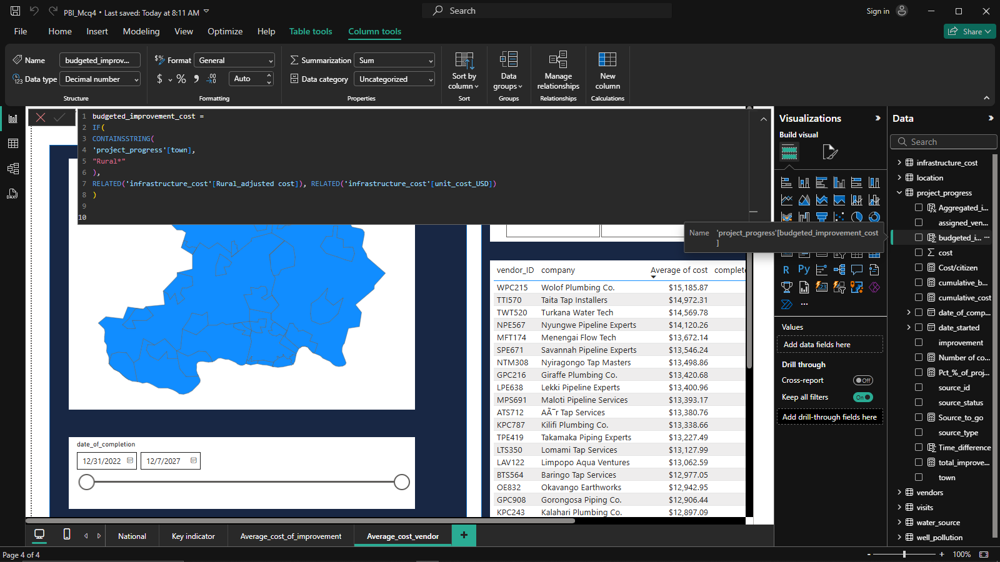
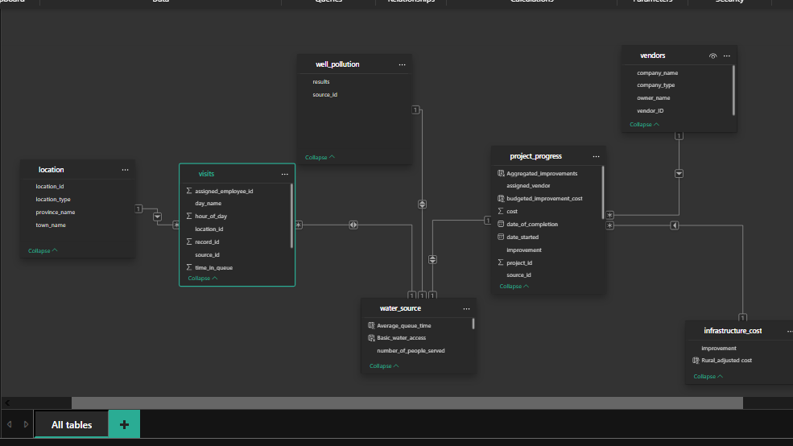
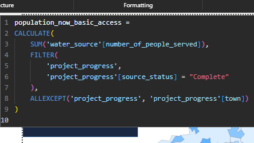
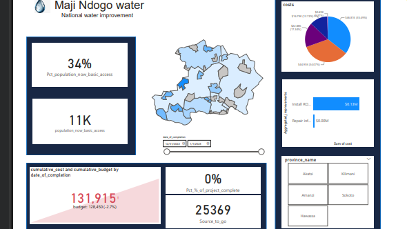
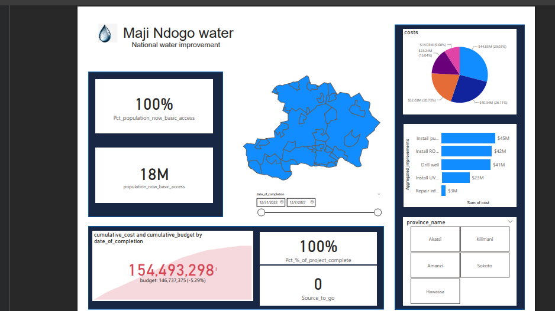
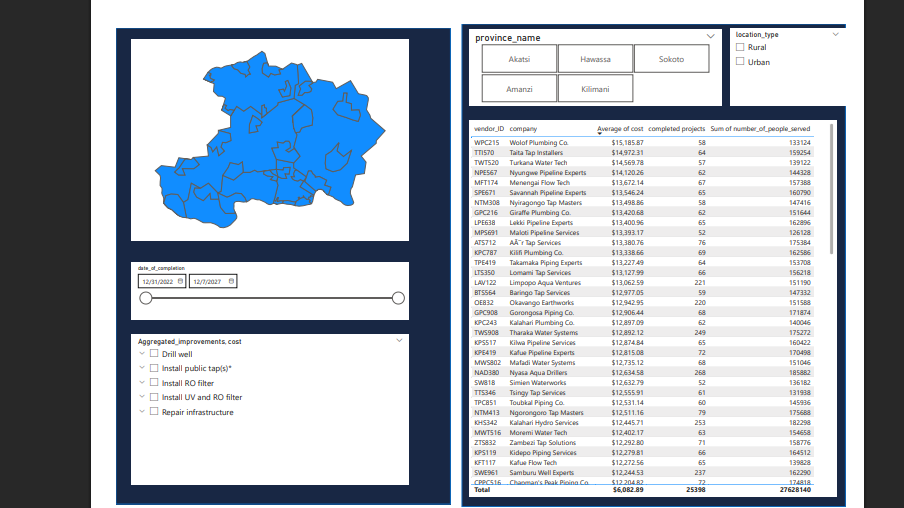
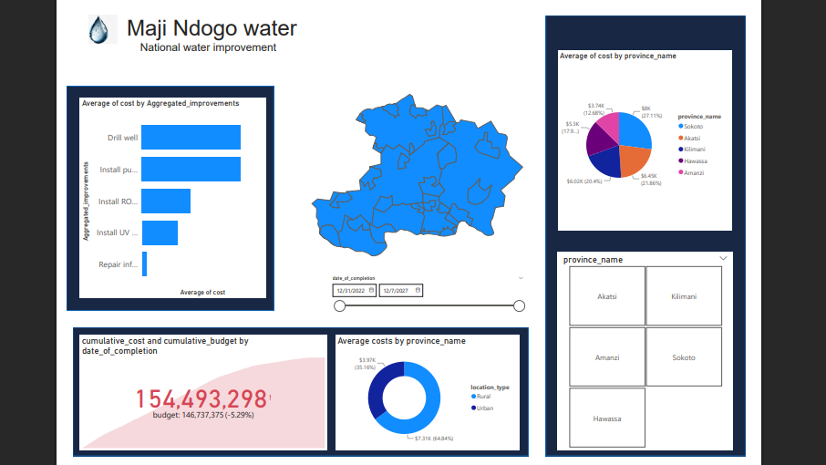

# Maji Ndogo Project

## 🎥 Project Overview (Video)
---
  
*Video credit: ALX Africa*

## 📘 Introduction
This Power BI project showcases a fictional water initiative in the community of **Maji Ndogo**.

It explores the evolution of a water crisis and evaluates the outcomes of a national improvement campaign focused on water source upgrades and spending across **Maji Ndogo**. The dashboard was designed to support transparency and enhance strategic decision-making.

> **_Note:_** _All datasets and visualizations are fictional and created for learning purposes, intended to demonstrate my Power BI capabilities._

## ❓ Problem Statement
Despite considerable funding, there was no clear way to assess:
1. Where water infrastructure improvements were taking place  
2. How funds were allocated and used  
3. Which vendors were involved  
4. The actual impact on the community  
5. What specific resources were paid for  
6. The overall progress of the project and completed sources  

## 🧠 Skills & Concepts Demonstrated
This project demonstrates the use of various Power BI functionalities:
- Data transformation and cleaning with Power Query Editor  
- Dataset updating via Data Source Settings  
- Advanced DAX metrics (e.g., project progress %, budget vs. cost)  
- Custom map visualizations using shape JSON files  
- Slicer interactions and drill-through capabilities  
- Data modeling (relationships and directional flow)  
- Performance tuning (removal of redundant data)  

## 🔍 Data Sources
Data for this project came from Excel files and includes:
- **Md_water_services_data.xlsx** – the main dataset with 7 tables:
  1. `Infrastructure_cost` (12 rows, 3 columns)  
  2. `Location` (39,650 rows, 4 columns)  
  3. `Project_progress` (25,398 rows, 13 columns)  
  4. `Visit` (60,146 rows, 9 columns)  
  5. `Water_source` (39,650 rows, 5 columns)  
  6. `Well_pollution` (17,383 rows, 2 columns)  
- **External vendor data** (95 rows, 4 columns)  
- **Updated financial and completion records** (2023–2024)  
- **Custom shape map JSON** for town, provincial, and national visualizations  

## 🧹 Data Transformation
Key data prep activities included:
- Removing irrelevant columns/tables (`address`, `comments`, `pollutant_ppm`, `date`, `queue_composition`, `water_source_related_crime`)  
- Merging external vendor data via the `assigned_vendor` field  
- Updating broken data in `budgeted_improvement_cost` using DAX  
- Creating measures like `total_number_of_improvement`  

## 🧱 Data Modeling
Power BI auto-created most relationships, but specific attention was given to:
- Connecting `project_progress` with `vendor`  
- Verifying and adjusting relationships between `water_source` and `project_progress`  
- Using `ALLEXCEPT()` to manage filtering logic  

     :|: 

### Key DAX Measures
- `Total_improvement`  
- `Pct_project_complete`  
- `Population_now_access`  
- `Cumulative_budget` vs `Cumulative_cost`  

## 📊 Analysis & Visualization
The dashboard includes several pages:

### 📍 National Overview (Page 1)
- Percentage of population with basic water access  
- Budget vs. actual expenditure (KPI cards)  
- Geographic map showing progress by town  
- Cost distribution by improvement type and province  

  

### 📌 Key Indicators (Page 2)
- Cost analysis by vendor  
- Comparing low-cost vs high-cost vendors  

### 🔎 Budget Drivers (Page 3)
- Average cost per improvement  
- Comparisons by:
  - Province  
  - Type of improvement  
  - Rural vs. Urban settings  

## 📈 Key Insights
- **Sokoto province** has exceeded budget by nearly 40% due to challenging terrain and long travel distances.  
- **48%** of the population now has access to basic water services (up from 34% over 5 years).  
- **22%** of the total project is completed.  
- Vendors with higher costs are mostly operating in difficult environments, not necessarily inflating prices.  

## 🔚 Conclusion
This dashboard helps bridge the gap between on-the-ground operations and stakeholders by:
- Visualizing how funds are spent  
- Tracking upgrades geographically and over time  
- Supporting better planning and resource allocation  

## 📎 Additional Notes
- This is my first GitHub-hosted project.  
- I appreciate you taking the time to view it.
